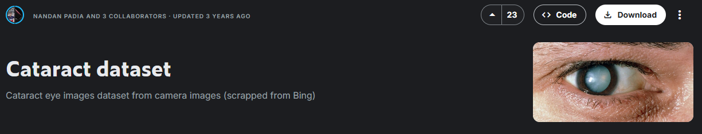
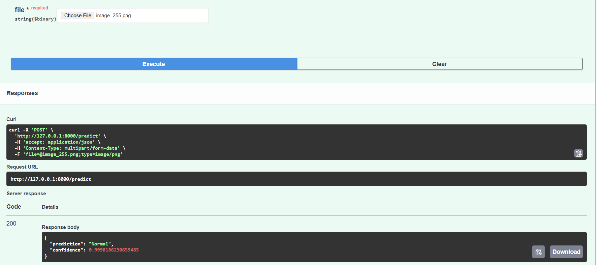
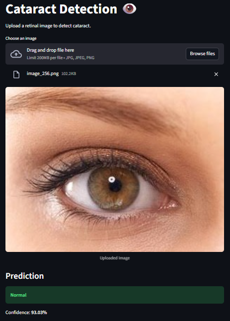
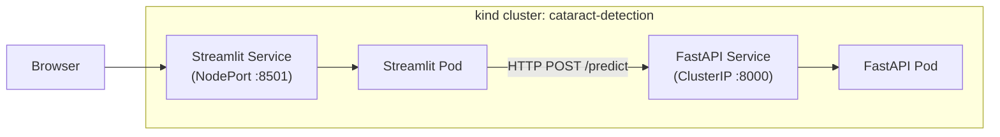

# 👁️ Cataract Detection
<div align="center">
  
</div>

**End-to-end ML system for cataract detection with deep learning, Docker, and Kubernetes**


KaggleOpen Streamlit App

This repository was created as part of the DataTalks.Club's Machine Learning Zoomcamp by Alexey Grigorev.

This project has been submitted as the Capstone project for the course.

---
## Overview
A cataract is a common eye condition in which the normally clear lens of the eye becomes cloudy, leading to blurred or impaired vision. The lens plays a critical role in focusing light onto the retina, and any loss of its transparency can significantly affect visual clarity.

Cataracts most commonly develop with aging and are one of the leading causes of visual impairment worldwide. While cataracts can occur at any age, including congenital cases, age-related cataracts account for the majority of diagnoses. When detected early, visual symptoms may be mild; however, advanced cataracts can lead to significant vision loss if left untreated.

## Causes
Cataracts develop when changes occur in the proteins and fibers within the eye’s lens, causing them to clump together and scatter light. These changes are most often associated with aging but may also be influenced by several other factors.

Common causes and risk factors include:

- Aging (the most significant risk factor)
- Prolonged exposure to ultraviolet (UV) radiation
- Diabetes mellitus
- Smoking and excessive alcohol consumption
- Eye trauma or previous eye surgery
- Long-term use of corticosteroid medications
- Genetic predisposition or congenital conditions

These factors can accelerate lens protein degeneration, leading to progressive clouding and reduced visual acuity.

## Clinical Significance

Cataracts are typically diagnosed through a comprehensive eye examination and are often treatable with surgical intervention. Cataract surgery involves replacing the cloudy lens with an artificial intraocular lens (IOL) and has a high success rate.

Early detection plays an important role in preventing severe vision impairment. Automated cataract detection systems using medical imaging and deep learning models, such as convolutional neural networks, have the potential to support clinical screening and improve accessibility to eye care services.

## Repository Structure

```text
cataract-detection/
│
├── src/
│   ├── model.py              # ✅ model architecture (THIS is Step 1)
│   ├── train.py              # training loop
│   ├── evaluate.py           # validation / test evaluation
│   ├── predict.py            # inference script (optional)
│
├── convert/
│   ├── convert_to_onnx.py    # ONNX export script
│
├── data/
│   └── sample_images/          # Sample eye images for testing/demo
│
├── notebooks/
│   ├── train.py                # Model training script
│   ├── evaluate.py             # Model evaluation and metrics
│
├── model/
│   └── mobilenet_v4_06_0.980.pth                # Trained CNN model 
├── app/
│   ├── app.py                  # FastAPI inference service
│   └── predict.py              # Prediction logic and preprocessing
│
├── streamlit_app/
│   └── ui.py                   # Streamlit user interface
│
├── docker/
│   └── Dockerfile              # Dockerfile for inference service
│
├── k8s/
│   ├── deployment.yaml         # Kubernetes Deployment
│   └── service.yaml            # Kubernetes Service
│
│── images/
│
├── requirements.txt            # Python dependencies
├── Makefile                    # Common project commands
└── README.md                   # Project documentation


/kaggle/working/split_data/
  ├── train/
  │   ├── cataract/
  │   └── normal/
  └── val/
      ├── cataract/
      └── normal/
```
---
## Dataset
In this project, the following Kaggle dataset has been used: [Cataract Dataset](https://www.kaggle.com/datasets/nandanp6/cataract-image-dataset)



The dataset can be downloaded with the following code:
```
import kagglehub

# Download latest version
path = kagglehub.dataset_download("nandanp6/cataract-image-dataset")

print("Path to dataset files:", path)
```
## About the dataset

The images in this dataset are cataract eye images dataset from camera captures which have been scrapped from the web. 

The dataset has 612 images split as `cataract` and `normal` under train and test folders. 

The train dataset has 491 images: 245 as cataract and 246 as normal. 

The test has 121 images: 61 as cataract and 60 as normal.

## Exploratory Data Analysis (EDA)

### Dataset Overview
- Number of images per class
- Class balance

### Image Characteristics
- Resolution and aspect ratio distribution
- Color and intensity variability

### Visual Inspection
- Sample images from each class
- Observed intra-class variability

### Data Augmentation Validation
- Visual confirmation of geometric and blur augmentations

### Observations
- Cataract images exhibit lens opacity and reduced clarity
- High variability in lighting and zoom motivates data augmentation


## Model Training

The final trained model is stored as a versioned artifact using GitHub Releases, separate from the training code, to ensure reproducibility and clean version control and can be found below:

- **Model**: MobileNetV2 Cataract Detector
- **Version**: v1.0
- **Test Accuracy**: 98.35%

📦 Download Mobilenet Pytorch Model:
```
wget https://github.com/eadka/cataract_detection/releases/download/v1.0-mobilenet-cataract/mobilenet_v4_06_0.980.pth
```

Next, the model trained in PyTorch is exported to ONNX, and served via FastAPI to create a lightweight, portable, and production-ready inference service. The ONNX model can be downloaded from the below link:

📦 Download ONNX Model:
```
wget https://github.com/eadka/cataract_detection/releases/download/v1.0.1-mobilenet-cataract-onnx/cataract_mobilenet_v2_fixed.onnx
```


## Exporting notebook to script
The final model in the notebook has been exported to a script and can be found here: [model.py](https://github.com/eadka/cataract_detection/blob/main/src/model.py)

Then, the [convert_to_onnx.py](https://github.com/eadka/cataract_detection/blob/main/convert/convert_to_onnx.py) script is used to convert the [model.py](https://github.com/eadka/cataract_detection/blob/main/src/model.py) to an onnx format.


## Reproducibility & Model Deployment
### Streamlit + FastAPI
The project includes a Streamlit web application that acts as a frontend UI for the cataract detection system.
Instead of running inference locally, Streamlit sends uploaded images to the FastAPI backend for prediction.

```
┌────────────────────┐
│    Streamlit UI    │
│  (User Interface)  │
│                    │
│  • Image upload    │
│  • Prediction view │
└─────────┬──────────┘
          │ HTTP POST (multipart/form-data)
          ▼
┌────────────────────┐
│      FastAPI       │
│   /predict API     │
│                    │
│  • Input validation│
│  • Image preproc   │
└─────────┬──────────┘
          │
          ▼
┌────────────────────┐
│   ONNX Runtime     │
│                    │
│  • Model inference │
│  • Softmax probs   │
└─────────┬──────────┘
          │
          ▼
┌────────────────────┐
│   JSON Response    │
│                    │
│  {label, confidence}│
└────────────────────┘
```
This separation mirrors a production-ready architecture, where:
- Streamlit handles user interaction and visualization
- FastAPI handles model inference and business logic
- ONNX Runtime performs efficient, framework-agnostic inference

#### How Streamlit Communicates with FastAPI
- Users upload an image via the Streamlit UI
- The image is sent to the FastAPI /predict endpoint using an HTTP POST request
- FastAPI runs inference using the ONNX model
- Prediction label and confidence score are returned as JSON
- Streamlit displays the result to the user

## Dependency and enviroment management

This project uses a layered approach to dependency and environment management to support local development, reproducibility, and containerized deployment.

1. Local Development: uv + pyproject.toml

For local development and experimentation, dependencies are managed using uv and a pyproject.toml file.
- uv provides:
  - Fast dependency resolution
  - Reproducible environments
  - A modern alternative to `pip + virtualenv`
- Core dependencies are declared in pyproject.toml:
- Locking is handled via:
  - uv.lock (ensures consistent versions across environments)

This setup was used during:
- Model serving development
- API testing
- Streamlit ↔ FastAPI integration

2. Runtime Dependencies: requirements.txt (Docker)

For containerized execution, the project uses explicit requirements.txt files instead of uv.

Each service has its own dependency file:
- serve/requirements.txt → FastAPI + ONNX runtime
- streamlit_app/requirements.txt → Streamlit UI + HTTP client

This allows:
- Smaller images
- Clear separation of concerns
- Independent service scaling

3. Environment Variables
Environment-specific configuration is handled via environment variables, making the system portable and Docker-friendly.

Example:
```
FASTAPI_URL = os.getenv(
    "FASTAPI_URL",
    "http://fastapi:8000/predict"
)
```
This enables:
- Local execution (localhost)
- Docker Compose service discovery (fastapi)
- Cloud deployment without code changes

4. Containerized Isolation (Docker)
The application is fully containerized using Docker + Docker Compose:
- Each service runs in its own container:
  - FastAPI → model inference
  - Streamlit → UI layer
- Dependencies are isolated per service
- Python versions and OS libraries are fixed

This ensures:
- No dependency conflicts
- Consistent behavior across machines
- Deployment-ready architecture

## Docker
🐳 Dockerized Deployment (FastAPI + Streamlit)

This project is fully containerized using Docker Compose, enabling consistent and reproducible deployment of both the FastAPI inference service and the Streamlit UI.

#### Run Docker
From the project root:
```
docker compose build
docker compose up
```

#### Access the Applications
FastAPI Swagger UI
👉 http://localhost:8000/docs

Upload an image and click on Execute to check the result.

Two sample images are provided in the [images folder](https://github.com/eadka/cataract_detection/tree/main/images) for testing:
  - `test_image_cataract.png`
  - `test_image_normal.png`



The result should appear as:
```
{
  "prediction": "Normal",
  "confidence": 0.9998186230659485
}
```

Streamlit UI
👉 http://localhost:8501

Using the Streamlit App:
- Upload an eye image (.png, .jpg, .jpeg)
- Click Run Prediction
- View the predicted class (Cataract or Normal) and confidence score
- The prediction is generated by the FastAPI backend and returned in real time.

Example Output:
```
Prediction: Cataract
Confidence: 0.9998
```

Screenshot of the Streamlit app:
<p align="center">
  
</p>

## Kubernetes
This project supports deploying FastAPI and Streamlit to a local Kubernetes cluster using [kind](https://kind.sigs.k8s.io/). This allows you to run the full application in an **isolated cluster**, mimicking a production environment.


Our Kubernetes architecture:
```
Browser
  ↓
NodePort (30007)
  ↓
Streamlit Pod
  ↓ HTTP
fastapi-service (ClusterIP)
  ↓
FastAPI Pod
  ↓
ONNX model inference
```

### 🗺️ Kubernetes Architecture



FastAPI communicates with Streamlit internally via Kubernetes services.

Streamlit exposes a NodePort for browser access.

📂 **Directory Structure**
```
k8s/
├─ fastapi/
│  ├─ deployment.yaml       # FastAPI Deployment
│  └─ service.yaml          # FastAPI ClusterIP Service
├─ streamlit/
│  ├─ deployment.yaml       # Streamlit Deployment
│  └─ service.yaml          # Streamlit NodePort Service
```

⚙️ **Prerequisites**
- Docker & Docker Compose
- kind
- kubectl

All container images should be built locally and loaded into the kind cluster.

```
docker build -t cataract_detection-fastapi:latest ./serve
docker build -t cataract_detection-streamlit:latest ./streamlit_app
kind load docker-image cataract_detection-fastapi:latest --name cataract-detection
kind load docker-image cataract_detection-streamlit:latest --name cataract-detection
```

**Create the Cluster**
```
Create the Cluster
```

Verify:
```
kind create cluster --name cataract-detection
```

Expected output:

```
NAME                               STATUS   ROLES           AGE   VERSION
cataract-detection-control-plane   Ready    control-plane   1m    v1.xx.x
```

📦 **Deploy the Applications**
```
# Deploy FastAPI
kubectl apply -f k8s/fastapi/deployment.yaml
kubectl apply -f k8s/fastapi/service.yaml

# Deploy Streamlit
kubectl apply -f k8s/streamlit/deployment.yaml
kubectl apply -f k8s/streamlit/service.yaml
```

Check pods and services:
```
kubectl get pods
kubectl get svc
```

Pods should show `1/1 Running`.

🌐 **Access the Applications**

FastAPI (inside cluster)
```
kubectl port-forward svc/fastapi 8000:8000
```

Visit: http://127.0.0.1:8000/docs


Streamlit (NodePort)
```
kubectl port-forward svc/streamlit-service 8501:8501
```

Visit: http://127.0.0.1:8501

Streamlit communicates with FastAPI internally via the Kubernetes service `fastapi`.


🛑 **Shutdown the Cluster**
```
kubectl delete -f k8s/streamlit/
kubectl delete -f k8s/fastapi/
kind delete cluster --name cataract-detection
```


